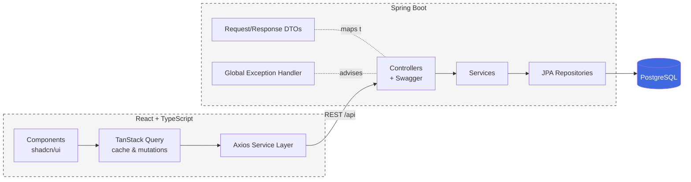

<div align="center">

# Job Tracker

### A Full-Stack Application for Managing the Job Search

[](https://openjdk.org/)
[](https://spring.io/projects/spring-boot)
[](https://www.postgresql.org/)
[](https://react.dev/)
[](https://www.typescriptlang.org/)
[](https://tanstack.com/query)
[](https://www.docker.com/)

**A containerized full-stack app for tracking job applications, built as a hands-on way to learn current production patterns end to end.**

> **Status:** Actively in development. The backend REST API for jobs and companies is functional and tested, and the frontend supports adding, editing, deleting, sorting, searching, and filtering applications. Analytics and UI styling are still being built.

---

</div>

## Why I Built This

I needed a real tool to keep my own job search organized, and I wanted a project where I could learn the patterns I kept seeing in job postings rather than just reading about them. So I built Job Tracker as both: a practical application I actually use, and a sandbox for working through the full lifecycle of a modern web app.

The goal was to go past basic CRUD and get hands-on with the things that separate a tutorial project from production code: clean separation between API contracts and database entities, efficient relational queries, centralized error handling, server-side data caching, and containerization that lets the whole stack run with a single command.

---

## Skills Demonstrated

| Domain | Technologies & Concepts |
|--------|-------------------------|
| **Backend** | Java 21, Spring Boot, Spring Data JPA, Bean Validation, Lombok |
| **API Design** | REST, Request/Response DTOs (Java records), centralized exception handling, OpenAPI/Swagger documentation |
| **Database** | PostgreSQL, relational modeling, `JOIN FETCH` to avoid N+1 queries, JPQL aggregation with interface projections |
| **Frontend** | React 19, TypeScript, Vite, TanStack Query (server-state caching & mutations), React Router, shadcn/ui |
| **DevOps** | Docker multi-stage builds, Docker Compose orchestration across database, API, and UI |

---

## Architecture



The backend follows a layered structure (controller → service → repository) with DTOs forming the boundary between the API and the JPA entities, so the database schema is never exposed directly to clients. The frontend keeps server state in TanStack Query rather than local component state, which handles caching and keeps the UI in sync with the database after mutations.

---

## Features

### Job Application Management
- Full CRUD for job applications (create, read, update, delete)
- Each job tracks title, company, location, applied date, and status
- Application status modeled as a lifecycle: `APPLIED → INTERVIEWING → OFFERED → ACCEPTED / REJECTED`

### Company Tracking
- Jobs link to companies in a many-to-one relationship
- Companies store an optional career-page link, surfaced as a clickable link in the table
- Get-or-create logic reuses existing companies instead of duplicating them

### Data Table
- Sortable columns, global search, and status filtering (client-side)
- Built on shadcn/ui with a sidebar layout and routed pages

### REST API
- Documented and testable through Swagger UI
- Consistent error responses via a global exception handler (validation errors returned per-field)

---

## Tech Highlights

A few implementation details I put deliberate thought into:

- **Avoiding N+1 queries:** job lookups use `JOIN FETCH` to load the related company in a single query, paired with `open-in-view: false` so lazy loading can't silently fire extra queries during view rendering.
- **DTO boundary:** entities are never serialized directly. Java `record` DTOs define the API contract, with Bean Validation on the request side and Swagger schema annotations for documentation.
- **Server-state caching:** the frontend uses TanStack Query for fetching and mutations, with cache invalidation on save to keep job and company data consistent after writes.
- **Containerized stack:** a multi-stage backend Dockerfile keeps the runtime image small, and Docker Compose brings up the database, API, and UI together.

---

## Quick Start

### Prerequisites
- **Docker Desktop** running
- Ports `5173`, `8080`, and `5432` available

### Run the full stack

```bash
# Clone the repository
git clone https://github.com/Chazz236/JobTracker.git
cd JobTracker

# Build and start the database, backend, and frontend
docker compose up --build
```

### Access

| Service | URL | Description |
|---------|-----|-------------|
| **Frontend** | http://localhost:5173 | React application |
| **Backend API** | http://localhost:8080/api | REST endpoints |
| **Swagger UI** | http://localhost:8080/swagger-ui/index.html | Interactive API docs |
| **Database** | localhost:5432 | PostgreSQL |

---

## Project Structure

```
JobTracker/
├── compose.yaml                 # Orchestrates db + backend + frontend
│
├── backend/                     # Spring Boot REST API
│   ├── Dockerfile               # Multi-stage Maven build → JRE runtime
│   └── src/main/java/com/jobtracker/backend/
│       ├── controller/          # Job, Company, Analytics REST endpoints
│       ├── service/             # Business logic
│       ├── repository/          # Spring Data JPA + custom queries/projections
│       ├── model/               # JPA entities (Job, Company) + JobStatus enum
│       ├── dto/                 # Request/Response records
│       ├── exception/           # GlobalExceptionHandler + custom exceptions
│       └── config/              # OpenAPI configuration
│
└── frontend/                    # React + TypeScript (Vite)
    ├── Dockerfile
    └── src/
        ├── pages/               # Dashboard, Analytics
        ├── components/
        │   ├── jobs/            # Table, form, dialog, columns
        │   ├── layout/          # Sidebar + routed layout
        │   └── ui/              # shadcn/ui components
        ├── services/            # Axios API layer (jobs, companies, analytics)
        └── types/               # Shared TypeScript interfaces
```

---

## What I Learned

### Backend & API Design
- Structuring a Spring Boot app into clean controller / service / repository layers
- Using DTOs as records to decouple the API contract from JPA entities
- Centralizing error handling with `@RestControllerAdvice` for consistent responses
- Writing efficient JPQL with `JOIN FETCH` to control the queries Hibernate actually runs

### Frontend & State
- Managing server state with TanStack Query instead of manual `useEffect` fetching
- Using cache invalidation to keep relational data (jobs and their companies) in sync after mutations
- Building a typed service layer so the frontend types mirror the backend DTOs
- Composing a routed, component-driven UI with shadcn/ui

### Infrastructure
- Writing multi-stage Dockerfiles to keep runtime images small
- Orchestrating a three-service stack with Docker Compose so the whole app runs from one command

---

## Roadmap

- [ ] Build the analytics dashboard (summary cards + a dedicated analytics page)
- [ ] Move data fetching out of `App.tsx` into dedicated hooks
- [ ] Style and polish the UI, then add screenshots
- [ ] Deploy a live demo with seeded data
